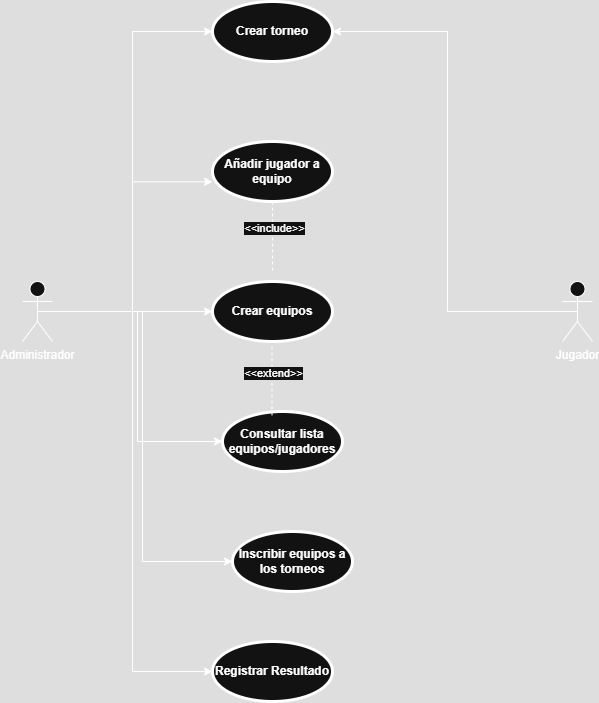
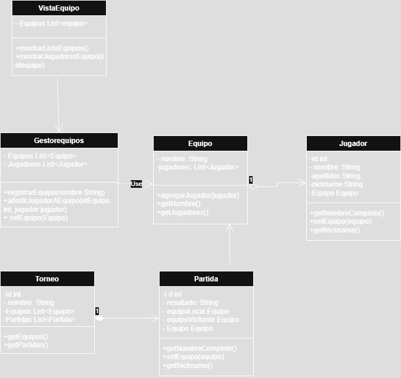

# Sistema de Gestión de Torneos de eSports 
 
## Autor 
Guillermo Olivares Bernat
[Mi perfil de GitHub ](https://github.com/llester000) 

## Descripción del Proyecto 
 
[Link al repositorio del proyecto ](https://github.com/llester000/torneo-esports-uml) 

Este proyecto implementa un sistema de gestión de torneos de eSports utilizando UML para el modelado y Java para la implementación. 
 
## Diagramas UML 
### Diagrama de Casos de Uso 
 
 
### Diagrama de Clases 
 
 
## Estructura del Proyecto 
 
torneo-esports-uml/ ├── src/ 
│ ├── es/empresa/torneo/ 
│ │ ├── modelo/ 
│ │ ├── control/ 
│ │ ├── vista/ 
│ │ ├── Main.java 
├── diagrams/ 
│ ├── casos-uso.png 
│ ├── clases.png 
├── README.md 
├── .gitignore 
